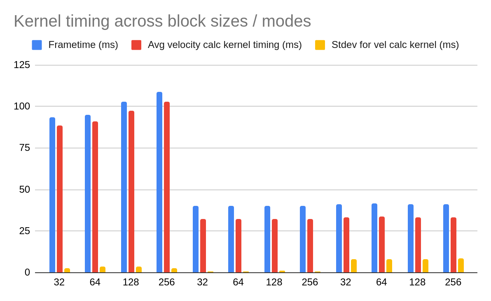

**University of Pennsylvania, CIS 5650: GPU Programming and Architecture,
Project 1 - Flocking**

* Thomas Shaw
  * [LinkedIn](https://www.linkedin.com/in/thomas-shaw-54468b222), [personal website](https://tlshaw.me), [GitHub](https://github.com/printer83mph), etc.
* Tested on: Fedora 42, Ryzen 7 5700x @ 4.67GHz, 32GB, RTX 2070 8GB

# Boids!!

## Performance Analysis

When increasing boid count with our naive method (left), we get a clearly exponential curve. This checks out, since we search through N boids N times. Moving over to the uniform grid implementation without contiguous data (center), we get a much shorter curve, which appears a bit less exponential. However, it does seem to have more deviation when it comes to kernel timings, which is likely due to the more variable amount of other boids that each boid (N) must search through. If any single boid in a warp has a lot of neighbors, the entire warp will be affected in timing. The contiguous data mode is similar, but appears closer to linear in nature, which would make sense up until we reach the limits of SM/SP count.

When changing block size, we can see a correlation between block size and kernel timing in the naive method (far left). In the uniform methods, both scattered and contiguous, there is no clear relation between block size and compute time, with numbers appearing flat throughout. This makes sense, seeing as the naive method simply gets limited by less and less warps being available, with each one taken up by some long, long raw computation and not I/O.

## Extra Credit

- Grid-Looping Optimization
  - This can be found in [kernel.cu](https://github.com/printer83mph/CIS5650-Project1-CUDA-Flocking/blob/0a3297f7ecc6c78a996bea0d2d22e4d4d889d054/src/kernel.cu#L485), in which we push the search radius out from the boid's current position. These points, aligned to the grid, are used as boundaries for the three nested `for` loops.